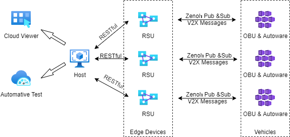

# Autocore Sdv Platform Doc 

Sdv Platform Document

For business and partnership, please visit our website: [www.autocore.ai](http://www.autocore.ai "AutoCore Homepage").

## Table of Contents

1. [Overview](#overview)  
2. [Quick Start Guide](#quick-start-guide)  
3. [Get Source Code and Tools](#get-source-code-and-tools)  
4. [Technical specifications](#technical-specifications)  

## Overview

SDV project is a cooperative project withFuturewei,which will provide the technology-consulting services to develop and promote the 100 percent open source SDV (Software Defined Vehicle) software stack with reference design, with native integration of Cloud-Edge service capability. The SDV software stack is based on open source Autoware/ROS2/DDS and Zenoh, where DDS/Zenoh form an E2E Vehicle-Edge-Cloud middleware layer for the SDV platform. Thru the integration with Futurewei’s open source KubeEdge project, the SDV platform will leverage Cloud Native Ecosystem tools to provide management, monitoring and software LCM (Life-Cycle-Management) functions. The overall SDV platform solution architecture is shown below:

 

## Quick Start Guide

## Get Source Code and Tools
To download the source code and tools required for the project, click the following links:
* [Source Code Acquisition](doc/Source_Code_Acquisition.md)  
* [Tool Acquisition](doc/Tool_Acquisition.md)  

## Technical specifications
