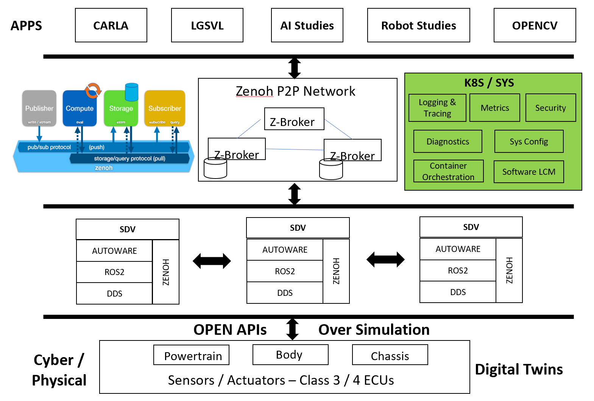

# Demo功能模块划分

文档内容迭代更新中

 

SDV Demo包括PC与PCU组成的集群，PC为一个，PCU为多个。PC侧主要用于显示、控制与交通流仿真，PCU侧主要用于车端模拟规划与控制功能。

## PC侧

### Cloud Viewer

云端监控程序提供图形化呈现与交互接口, 通过Zenoh的数据存储API获取场景中RSU与OBU状态并提供对活动对象进行临时配置的交互选项。

### Traffic Light RSU Pods

交通信号终端节点，模拟场景中的交通信号路侧设备。

### Automative Test

自动化测试系统驱动整个Demo系统的自动运行并记录分析测试数据

### K8Edge Cloud Core

整套SDV Demo处于K8Edge集群网络中，Cloud Core提供各Pod的控制API，自动化测试模块将调用这些API获取系统状态数据

## PCU侧

### OBU Pod

正常车端C-V2X通信节点，包括与Traffic Light RSU的通信和其他车辆OBU的V2V通信以及向Cloud的信息汇报

### V2X Externsion、 Planning、 Control and Simulator

Autoware的V2X拓展模块节点，由V2X数据更新附近目标信息给Autoware规划决策单元。同时具有规划、控制与单车仿真节点。具有amd64和arm64版本的镜像，可在X86上部署更多的此类节点。

### Safty Monitor

MCU上运行监视节点，一旦安全条件失效，由MCU端发送异常失效状态

### K8Edge Edge Core

K8Edge终端配置依赖